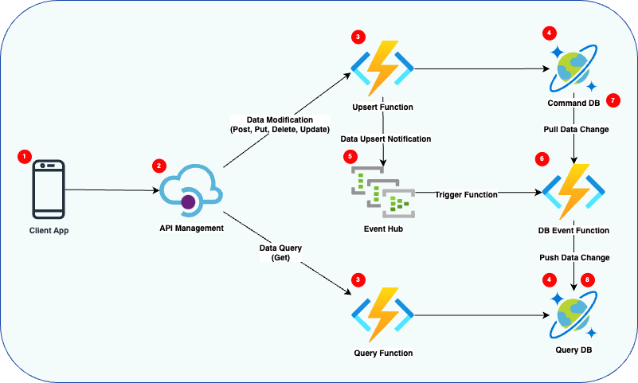

# CQRS on Azure: Enhancing Application Responsiveness and Scalability

## Overview

The Command Query Responsibility Segregation (CQRS) pattern is a powerful architectural approach that separates the read and write operations of a data store to optimize performance, scalability, and security. By implementing CQRS on Azure, applications benefit from Azure's robust, scalable cloud infrastructure and services, enhancing their capabilities to handle high volumes of data and transactions efficiently.

## Key Concepts

- **CQRS Fundamentals**: At its core, CQRS divides operations into two distinct categories: Commands (actions that modify data) and Queries (actions that retrieve data), allowing for more flexible and optimized handling of data operations.
- **Azure Integration**: This section delves into how CQRS can be seamlessly integrated with Azure services, such as Azure Cosmos DB for data storage, Azure Functions for serverless compute options, and Azure Event Grid for event-driven architecture, to build responsive and scalable applications.
- **Design Considerations**: Outlines the important design decisions when implementing CQRS on Azure, including choosing the right data storage, handling eventual consistency, and ensuring secure access to data.

## Benefits of CQRS on Azure

1. **Scalability**: By separating read and write operations, applications can scale these operations independently, leveraging Azure's auto-scaling capabilities to meet demand without compromising performance.
2. **Performance Optimization**: CQRS allows for optimization of read and write data paths, improving overall application performance. Azure's global infrastructure further enhances this by reducing latency and increasing data throughput.
3. **Enhanced Security**: Separating commands and queries can lead to better security practices, as it allows for more granular control over access to data operations. Azure's advanced security features complement this by providing additional layers of protection.
4. **Flexibility and Maintainability**: The decoupling of read and write operations offers flexibility in the development process, allowing teams to update and maintain one side of the application without impacting the other. This can lead to more agile development cycles and easier maintenance over time.
5. **Event-Driven Architecture Compatibility**: CQRS naturally fits into event-driven architectures, allowing applications to react to changes in real-time. Azure supports this with services like Azure Event Hubs and Azure Notification Hubs, facilitating seamless communication between different parts of an application.

## Conclusion

Implementing the CQRS pattern on Azure offers a pathway to building highly responsive, scalable, and secure applications. By leveraging Azure's cloud services and infrastructure, developers can harness the full potential of CQRS, creating applications that are not only more efficient and reliable but also easier to manage and evolve over time.

---

This summary offers a concise overview of the CQRS pattern on Azure, emphasizing its benefits for application development. It outlines the pattern's key concepts, integration points with Azure services, and the advantages it brings in terms of scalability, performance, security, and maintainability.

## Architecture
# Technical Architecture
The following diagram provides the technical views for implementing the CQRS design pattern within Azure using Azure Functions and DotNet 8 Framework.

